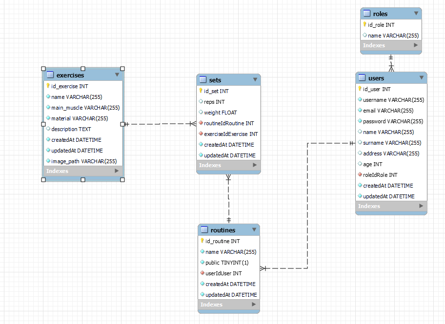

# Back end final project - Gym helper

This project required a functional API connected to a database with at least one one-to-many relationship and one many-to-many relationship.

I decided to make a web application to help out gym enjoyers, that would allow them to create and track new routines for their exercise journey. Next you can see the diagram for the relational database.

## Technologies used

## Instructions to use the project

* You can use this project without doing anything - it's deployed in Railway and you can use the endpoints provided later to use the original database directly.

However, if you want to create a local version, follow the next steps:

* Have NodeJS installed - download from the <a href="https://nodejs.org/en/">official page</a>
* Clone this repository:
  > git clone https://github.com/MaraScampini/backend-final-project.git
* Create a new Docker container.
* Create a new .ENV file following the template in the folder and input the credentials for your new dockerized database.
* Migrate and seed your database with the files provided in the folder.
  > npx sequelize-cli db:migrate
  > npx sequelize-cli db:seed:all

* Your database is ready to use!

## Use of the API

You can use the following Postman collection to test out all the endpoints described below in the deployed version of the API.

## Endpoints detailed

### Authentication

* POST - Register new users - provide username, email and password
* POST - Login to the web - provide email and password

### Users

* GET - See my profile
* GET - See all users (Admin only)
* PATCH - Edit my profile - Provide the fields you want to change. Available: name, surname, address, age.
* PATCH - Edit password
* DELETE - Delete my account (if it's not an admin account)
* DELETE - Delete users (Admin only - cannot delete admins)

### Exercises

* GET - See all exercises
* GET - See exercise by ID
* GET - Filter by material
* GET - Filter by main muscle
* GET - Double filter material + muscle
* GET - Filter by name

### Routines

* GET - See public routines (public endpoint)
* GET - See my routines
* GET - See routine by ID
* POST - Create new routine - Provide name and public / private boolean
* PATCH - Edit routine - Provide name or public / private state
* DELETE - Delete routine

### Sets

* GET - See sets by routine
* POST - Add set to a routine - Provide reps, weight, routine ID and exercise ID
* PATCH - Edit set - Provide reps, weight, routine ID and set ID
* DELETE - Erase set - Provide set ID and routine ID